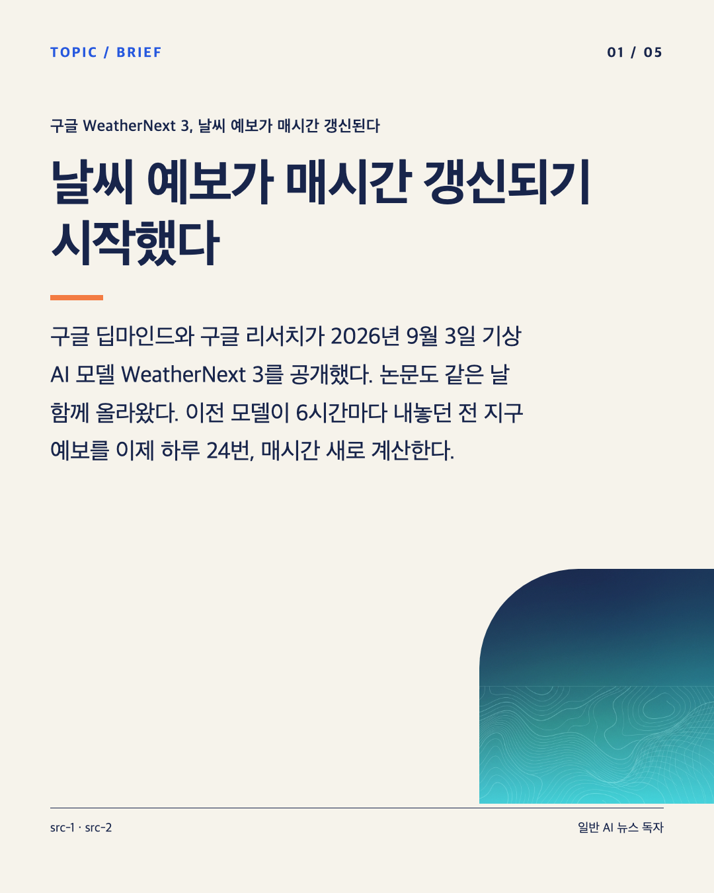

# 실제 실행 예시 — AI 최신소식

2026-09-08 실행한 시점의 결과이며 이후 최신 소식으로 간주하지 않습니다. 실제 검색 후보 10개 중 WeatherNext 3를 선택했고, 일반 AI 뉴스 독자를 대상으로 카드 5장을 제작했습니다. 배경은 이 작업에서 Antigravity로 새로 생성했습니다.

마지막 카드의 수치 설명은 검토 후 두 번 수정했습니다. 최종 결과는 v3이며 다른 4장 PNG는 최초 결과와 바이트 단위로 같습니다. 원고와 출처, 생성 기록, 수정 비교와 실행 측정치를 함께 제공합니다. 생성 결과의 사실관계를 언제나 자동으로 보증한다는 의미는 아닙니다.

[완성 카드 ZIP](card-news.zip) · [출처](sources.md) · [원고](storyboard.json) · [실행 기록](execution-record.json)
